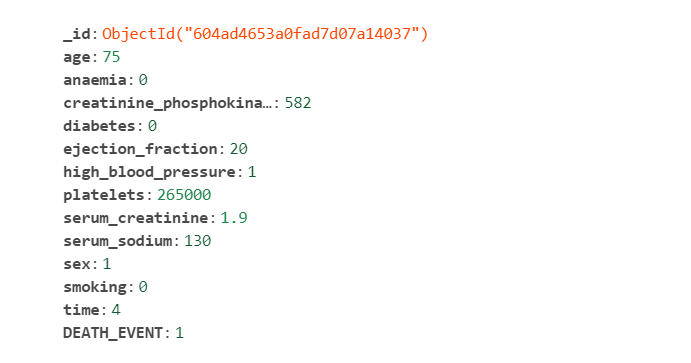
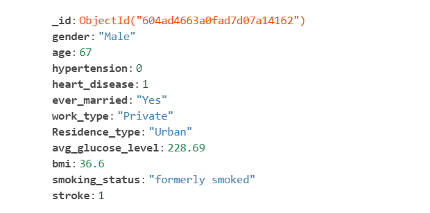
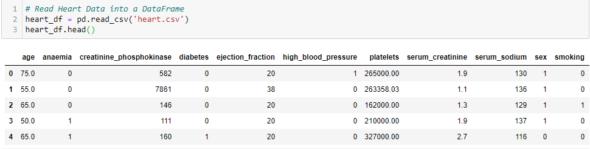
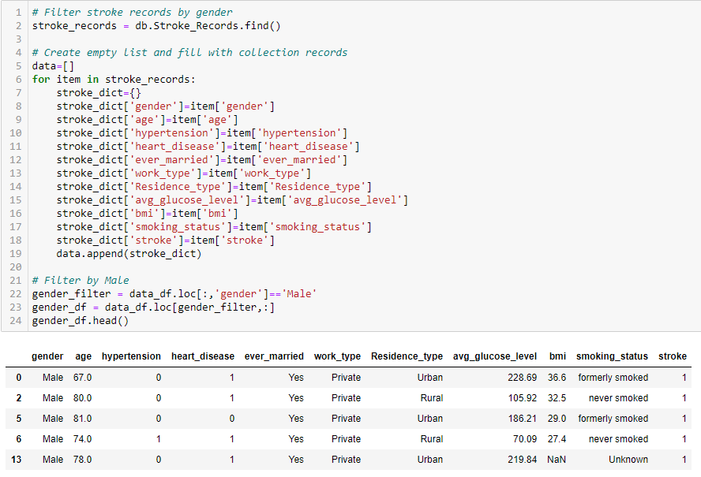
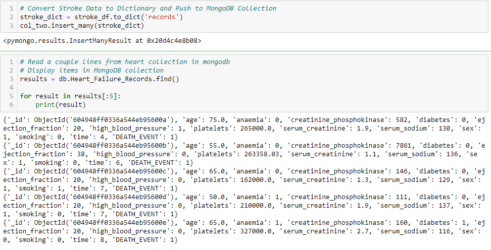
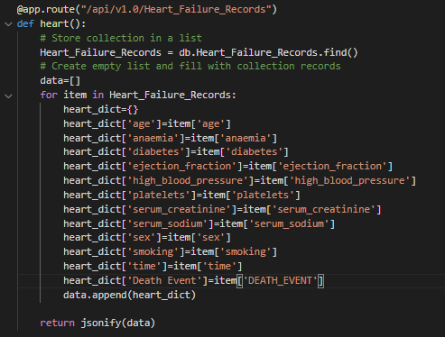
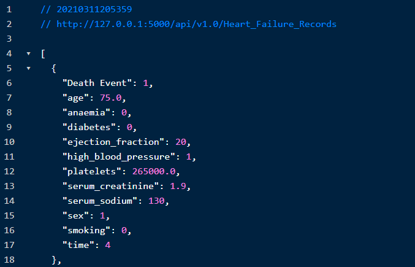

# ETL-Project | Heart Failure & Stroke API

---
## Background & Challenge

According to the [Centers for Disease Control](https://www.cdc.gov/nchs/fastats/leading-causes-of-death.htm) and Preventions’ National Center for Health Statistics, heart disease and stroke are the first and fifth most common cause of death in the United States. The aim of this project is to help inform the public of common heart and brain health metrics to be aware of, by generating a user-friendly API that can be queried by both medical professionals and laymen alike. Due to the disparate nature of the data collected between each dataset, a Non-Relational (NoSQL) database has been selected to store the data for ease of use and portability.

---
## ETL & API Development Toolkit

* Python
* Pandas
* Flask
* Pymongo
* Jupyter Notebook
* MongoDB

---
## Data Sources

> [Stroke Prediction Dataset](https://www.kaggle.com/fedesoriano/stroke-prediction-dataset) - Datasets containing 11 clinical features for analyzing stroke events.

> [Heart Failure Dataset](https://www.kaggle.com/andrewmvd/heart-failure-clinical-data) - Data set of Heart Failure clinical data

---
## Data Attributes
 

*Figure 1: Screenshot of MongoDB Post in Heart_Failure Collection*

*Figure 2: Screenshot of MongoDB Post in Stroke Collection*

---
## ETL Process Summary

**EXTRACT**: Each dataset was downloaded from Kaggle.com in CSV format and subsequently loaded into a Jupyter Notebook for data munging and cleaning as required.

**TRANSFORM**: Data has been grouped by key categorical variables to produce common aggregated queries across each dataset.

**LOAD**:  Using the pymongo module available for Python, insert raw and transformed tables into MongoDB to serve as a backend for a Flask API

 

---
## API Documentation

An application programming interface (API) is a computing interface that defines interactions between multiple software or mixed hardware-software intermediaries. It defines the kinds of calls or requests that can be made, how to make them, the data formats that should be used, the conventions to follow, etc. It can also provide extension mechanisms so that users can extend existing functionality in various ways and to varying degrees.[1](https://en.wikipedia.org/wiki/API#cite_note-Fisher1-1) 

The Heart Failure and Stroke Database API contains six easily accessible routes that can handle requests without the need for an access key or credentials, it is fully open sourced. The following is a list of the available API routes along with utilization parameters and output examples.

* Below route returns all heart records from database:
    > /api/v1.0/Heart_Failure_Records

* Below route returns all stroke records from database:
    > /api/v1.0/Stroke_Records

* Below route returns heart failure death by mean age | Death = 1, Non-Death = 0:
    > /api/v1.0/Heart_Failure_by_Age

* Below route returns strokes by mean age | Stroke = 1, no stroke = 0:
    > /api/v1.0/Stroke_by_Age

* Below route returns heart failure data by smoking or not | **Input 1 for Smoker, 0 for Non-Smoker**:
    > /api/v1.0/Heart_Failure_by_Smoking/

* Below route returns stroke data by gender | **Input Male or Female**:
    > /api/v1.0/Stroke_by_Gender/

*Figure 6: Screenshot of Flask Route located in app.py*

 

*Figure 7: Screenshot of JSON output from Flask API*

---
## Operating Instructions

* Install MongoDB Community Addition
* Clone this repository, maintaining directory paths
* Open GitBash/Terminal and install any missing dependencies as noted in the development toolkit section of the readme.md
* Open and run Jupyter Notebook from repository
* From GitBash/Terminal run app.py to initialize local server
* Open browser and navigate to http://localhost:5000/
* From this landing screen, select desired route and add to the above landing path, including any necessary user input parameters as defined by the above route instructions